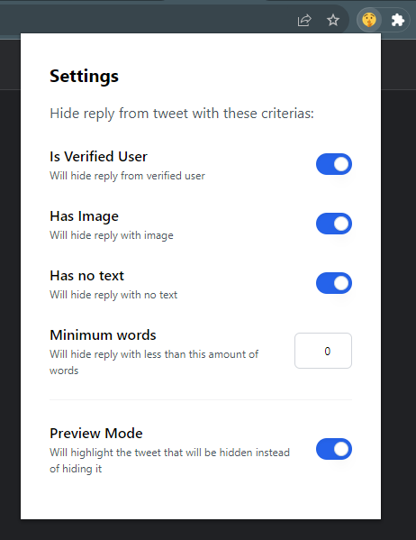

# No Gimmick Reply

- [No Gimmick Reply](#no-gimmick-reply)
  - [Installing the Extension](#installing-the-extension)
    - [Chrome](#chrome)
  - [Using the Extension](#using-the-extension)
  - [Building "No Gimmick Reply" from Source](#building-no-gimmick-reply-from-source)
    - [Requirements](#requirements)
    - [Build](#build)
    - [Package](#package)
- [Permissions](#permissions)
  - [Host Permissions](#host-permissions)
  - [API Permissions](#api-permissions)

No Gimmick Reply is a browser extension available for Chrome. It empowers you to enjoy clutter-free conversations by filtering out unwanted replies and leaving you with genuine interactions.

> Note: This extension requires certain permissions to enhance your browsing experience. See [Permissions](#permissions) for details.

## Installing the Extension

### Chrome

1. Download the latest release from [Releases](https://github.com/falfox/no-gimmick-reply/releases) and extract it to a secure location.
2. Access Chrome's Extension page: Click the three dots menu > Settings > Extensions (alternatively, type `chrome://extensions` in the address bar).
3. Activate Developer Mode by toggling the switch at the top right corner of the page.
4. Click "Load unpacked" at the top right, then select the extracted extension folder from step 1.
5. Look for the  No Gimmick Reply extension in your list of installed extensions.
6. For convenient access, you can pin the extension to your browser's toolbar from the extensions toolbar menu.

## Using the Extension
To use the "No Gimmick Reply" extension, follow these steps:

1. Install the extension by following the instructions in the "Installing the Extension" section of the README file. This involves downloading the latest release from the Releases page on GitHub and extracting it to a secure location. Then, access Chrome's Extension page, activate Developer Mode, and load the unpacked extension.

2. Once the extension is installed, you can access its settings by clicking on the extension icon in your browser's toolbar.

3. In the settings, you can configure the extension to hide replies from tweets that meet certain criteria. For example, you can choose to hide replies from verified users, replies with images, replies with no text, or replies with less than a certain number of words.

4. You can also enable preview mode, which will highlight the tweets that would be hidden instead of hiding them.

5. Once you have configured the extension to your liking, it will automatically hide replies from tweets that meet your criteria.

## Building "No Gimmick Reply" from Source

### Requirements

No Gimmick Reply was developed using **Node 16.17.1** and **Yarn 1.22.19**. It's tested with **Chrome 116.0.5845.111 (Official Build) (64-bit)**.

### Build

- Clone this repository
- Run `yarn install`
- Execute `yarn build`
- The unpacked extension is built in the `./build/chrome-mv3-prod` directory
- Follow your browser's instructions to load an unpacked extension in development mode

### Package

- Run `yarn install`
- Run `yarn build`

# Permissions

This extension requires certain permissions to function properly. Here are the permissions required by this extension:

## Host Permissions

- `https://twitter.com/*`: This extension requires access to Twitter's website to function properly.

## API Permissions

- `tabs`: This permission allows the extension to access and modify the browser's tab system.
- `storage`: This permission allows the extension to store data on the user's device.
- `scripting`: This permission allows the extension to execute scripts in the context of web pages.

